# 论文插图 Mermaid 终稿

以下图全部用于论文草图临摹，统一采用 Mermaid 表达。  
原则：白底、黑灰边框、直线连接、结构完整，便于你在 Word 中按图重绘。

---

## 图 3-1 系统总体架构图

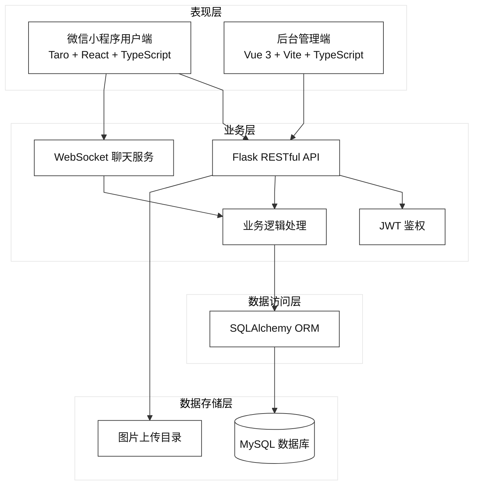

---

## 图 3-2 功能模块图

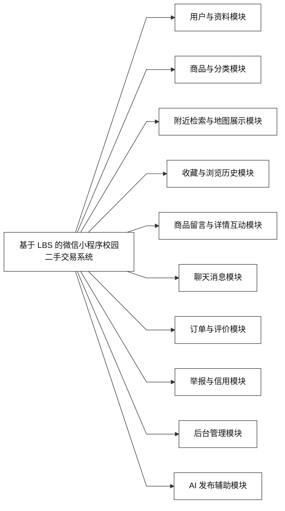

---

## 图 3-3 数据库 ER 图

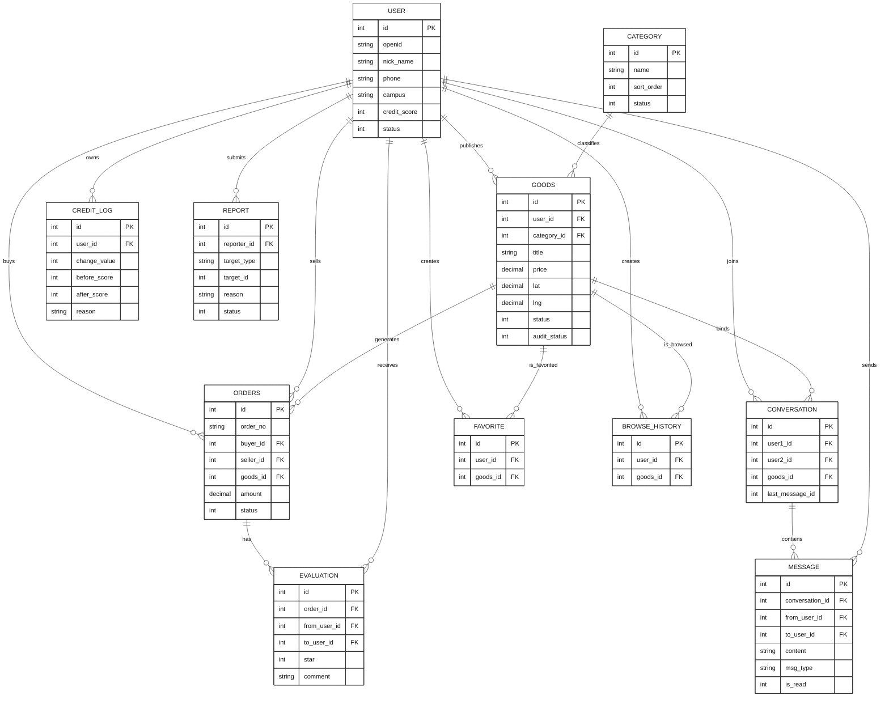

---

## 图 4-1 首页业务流程图

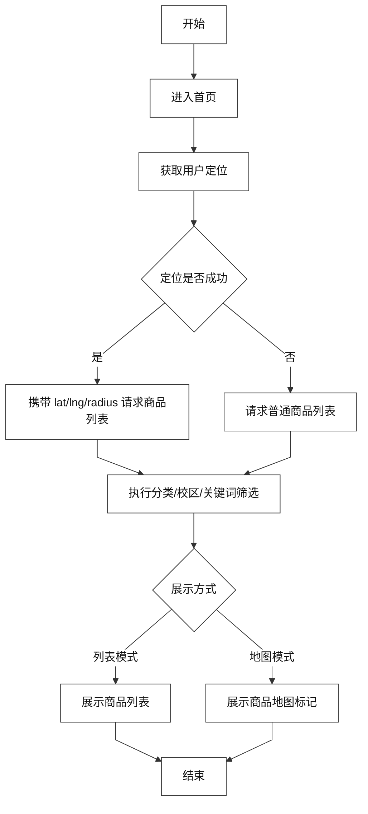

---

## 图 4-2 商品发布流程图

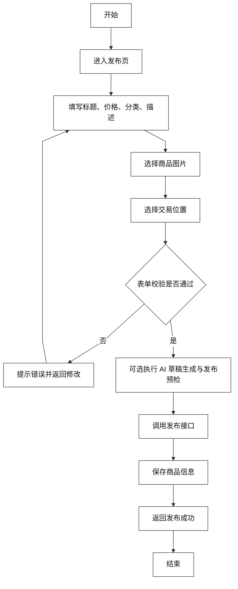

---

## 图 4-3 附近检索算法流程图

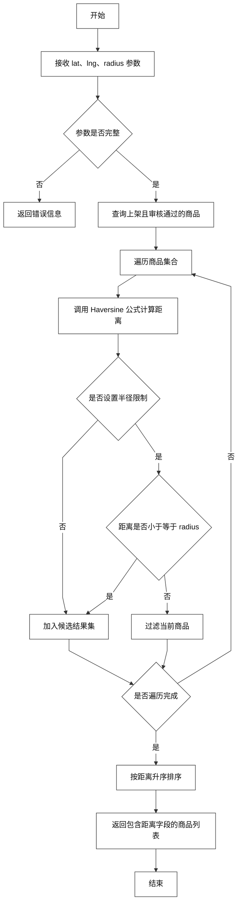

---

## 图 4-4 聊天模块时序图

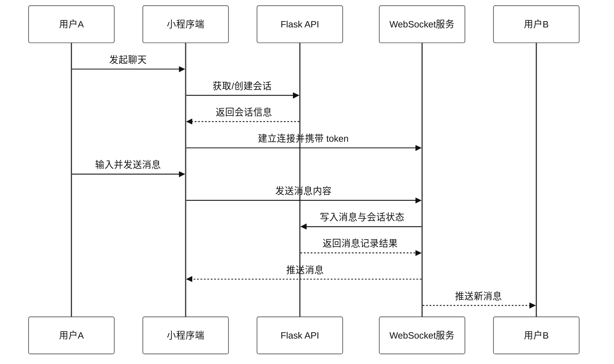

---

## 图 4-5 评价与信用分流程图

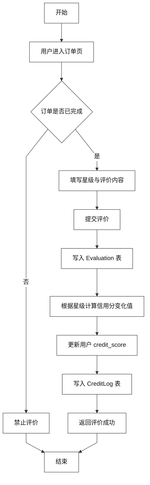

---

## 图 4-6 后台管理信息架构图

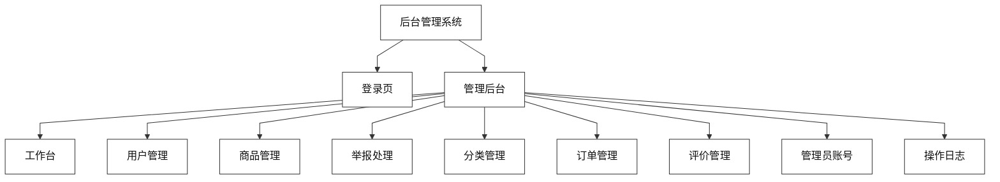

---

## 图 4-7 系统部署图

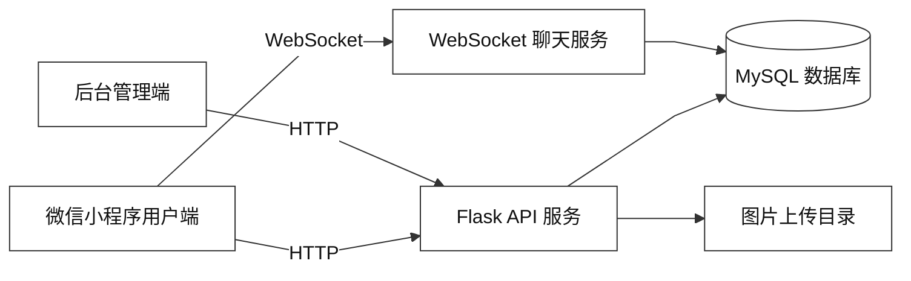

---

## 图 5-1 系统测试流程图

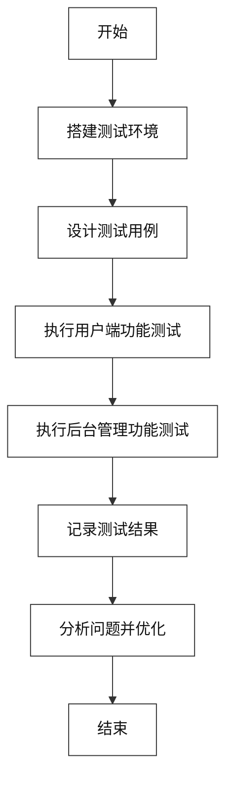

