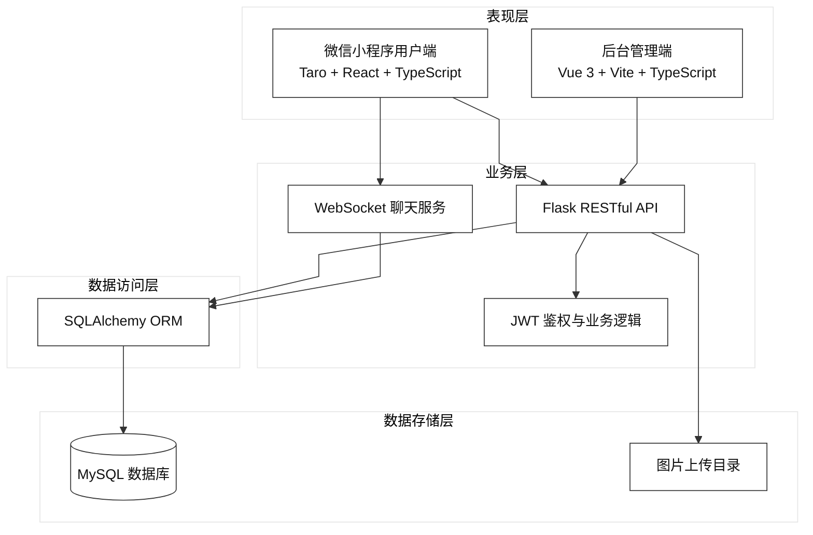

# 图 3-1 系统总体架构图

```mermaid
%%{init: {'theme': 'base', 'themeVariables': { 'primaryColor': '#ffffff', 'primaryTextColor': '#111111', 'primaryBorderColor': '#333333', 'lineColor': '#333333', 'secondaryColor': '#ffffff', 'tertiaryColor': '#ffffff', 'background': '#ffffff'}, 'flowchart': { 'curve': 'linear' }}}%%
flowchart TB
    subgraph A[表现层]
        A1[微信小程序用户端<br/>Taro + React + TypeScript]
        A2[后台管理端<br/>Vue 3 + Vite + TypeScript]
    end

    subgraph B[业务层]
        B1[Flask RESTful API]
        B2[WebSocket 聊天服务]
        B3[JWT 鉴权与业务逻辑]
    end

    subgraph C[数据访问层]
        C1[SQLAlchemy ORM]
    end

    subgraph D[数据存储层]
        D1[(MySQL 数据库)]
        D2[图片上传目录]
    end

    A1 --> B1
    A1 --> B2
    A2 --> B1
    B1 --> B3
    B1 --> C1
    B2 --> C1
    C1 --> D1
    B1 --> D2
```

图注建议：系统总体架构由表现层、业务层、数据访问层和数据存储层组成，用户端小程序与后台管理端通过 Flask API 和 WebSocket 服务访问后端业务能力，最终通过 ORM 完成对 MySQL 与文件资源的读写。
