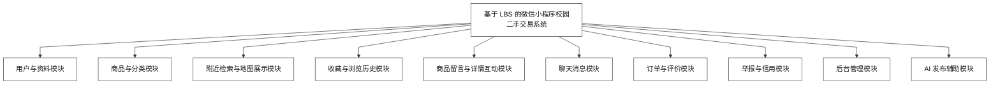

# 图 3-2 功能模块图

```mermaid
%%{init: {'theme': 'base', 'themeVariables': { 'primaryColor': '#ffffff', 'primaryTextColor': '#111111', 'primaryBorderColor': '#333333', 'lineColor': '#333333', 'secondaryColor': '#ffffff', 'tertiaryColor': '#ffffff', 'background': '#ffffff'}, 'flowchart': { 'curve': 'linear' }}}%%
flowchart TB
    S[基于 LBS 的微信小程序校园二手交易系统]

    S --> M1[用户与资料模块]
    S --> M2[商品与分类模块]
    S --> M3[附近检索与地图展示模块]
    S --> M4[收藏与浏览历史模块]
    S --> M5[商品留言与详情互动模块]
    S --> M6[聊天消息模块]
    S --> M7[订单与评价模块]
    S --> M8[举报与信用模块]
    S --> M9[后台管理模块]
    S --> M10[AI 发布辅助模块]
```

图注建议：系统以校园二手交易业务为核心，围绕用户、商品、LBS 检索、聊天订单、评价信用和后台治理等能力划分为多个功能模块，共同构成完整的平台业务体系。
