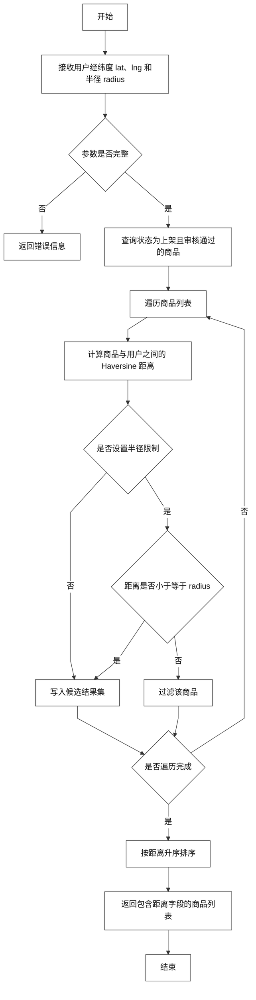

# 图 4-8 附近检索算法流程图

```mermaid
%%{init: {'theme': 'base', 'themeVariables': { 'primaryColor': '#ffffff', 'primaryTextColor': '#111111', 'primaryBorderColor': '#333333', 'lineColor': '#333333', 'secondaryColor': '#ffffff', 'tertiaryColor': '#ffffff', 'background': '#ffffff'}, 'flowchart': { 'curve': 'linear' }}}%%
flowchart TD
    A[开始] --> B[接收用户经纬度 lat、lng 和半径 radius]
    B --> C{参数是否完整}
    C -- 否 --> D[返回错误信息]
    C -- 是 --> E[查询状态为上架且审核通过的商品]
    E --> F[遍历商品列表]
    F --> G[计算商品与用户之间的 Haversine 距离]
    G --> H{是否设置半径限制}
    H -- 否 --> J[写入候选结果集]
    H -- 是 --> I{距离是否小于等于 radius}
    I -- 否 --> K[过滤该商品]
    I -- 是 --> J[写入候选结果集]
    J --> L{是否遍历完成}
    K --> L
    L -- 否 --> F
    L -- 是 --> M[按距离升序排序]
    M --> N[返回包含距离字段的商品列表]
    N --> O[结束]
```

图注建议：附近检索算法首先校验定位参数，然后筛选状态合法的商品，逐一计算用户与商品之间的球面距离，在半径约束下形成候选集，最终按距离升序返回结果。
