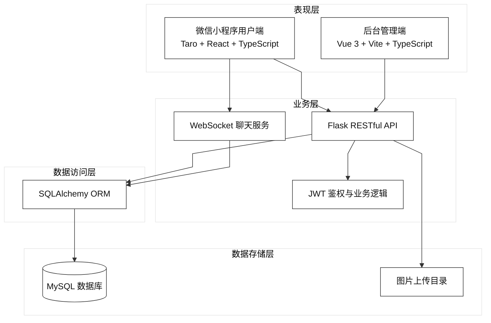
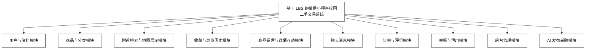
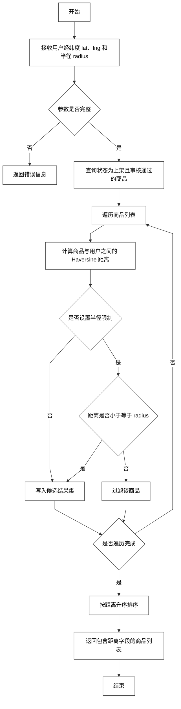

# 论文插图预览

本文档用于直接预览当前第一批论文插图。  
如果 VS Code 已安装 Mermaid 预览支持，打开本文件并使用 Markdown Preview 即可查看。

---

## 图 3-1 系统总体架构图

```mermaid
%%{init: {'theme': 'base', 'themeVariables': { 'primaryColor': '#ffffff', 'primaryTextColor': '#111111', 'primaryBorderColor': '#333333', 'lineColor': '#333333', 'secondaryColor': '#ffffff', 'tertiaryColor': '#ffffff', 'background': '#ffffff'}, 'flowchart': { 'curve': 'linear' }}}%%
flowchart TB
    subgraph A[表现层]
        A1[微信小程序用户端<br/>Taro + React + TypeScript]
        A2[后台管理端<br/>Vue 3 + Vite + TypeScript]
    end

    subgraph B[业务层]
        B1[Flask RESTful API]
        B2[WebSocket 聊天服务]
        B3[JWT 鉴权与业务逻辑]
    end

    subgraph C[数据访问层]
        C1[SQLAlchemy ORM]
    end

    subgraph D[数据存储层]
        D1[(MySQL 数据库)]
        D2[图片上传目录]
    end

    A1 --> B1
    A1 --> B2
    A2 --> B1
    B1 --> B3
    B1 --> C1
    B2 --> C1
    C1 --> D1
    B1 --> D2
```

---

## 图 3-2 功能模块图

```mermaid
%%{init: {'theme': 'base', 'themeVariables': { 'primaryColor': '#ffffff', 'primaryTextColor': '#111111', 'primaryBorderColor': '#333333', 'lineColor': '#333333', 'secondaryColor': '#ffffff', 'tertiaryColor': '#ffffff', 'background': '#ffffff'}, 'flowchart': { 'curve': 'linear' }}}%%
flowchart TB
    S[基于 LBS 的微信小程序校园二手交易系统]

    S --> M1[用户与资料模块]
    S --> M2[商品与分类模块]
    S --> M3[附近检索与地图展示模块]
    S --> M4[收藏与浏览历史模块]
    S --> M5[商品留言与详情互动模块]
    S --> M6[聊天消息模块]
    S --> M7[订单与评价模块]
    S --> M8[举报与信用模块]
    S --> M9[后台管理模块]
    S --> M10[AI 发布辅助模块]
```

---

## 图 4-8 附近检索算法流程图

```mermaid
%%{init: {'theme': 'base', 'themeVariables': { 'primaryColor': '#ffffff', 'primaryTextColor': '#111111', 'primaryBorderColor': '#333333', 'lineColor': '#333333', 'secondaryColor': '#ffffff', 'tertiaryColor': '#ffffff', 'background': '#ffffff'}, 'flowchart': { 'curve': 'linear' }}}%%
flowchart TD
    A[开始] --> B[接收用户经纬度 lat、lng 和半径 radius]
    B --> C{参数是否完整}
    C -- 否 --> D[返回错误信息]
    C -- 是 --> E[查询状态为上架且审核通过的商品]
    E --> F[遍历商品列表]
    F --> G[计算商品与用户之间的 Haversine 距离]
    G --> H{是否设置半径限制}
    H -- 否 --> J[写入候选结果集]
    H -- 是 --> I{距离是否小于等于 radius}
    I -- 否 --> K[过滤该商品]
    I -- 是 --> J[写入候选结果集]
    J --> L{是否遍历完成}
    K --> L
    L -- 否 --> F
    L -- 是 --> M[按距离升序排序]
    M --> N[返回包含距离字段的商品列表]
    N --> O[结束]
```
